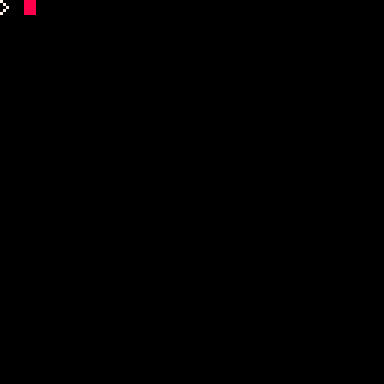

# p8-canvas


p8-canvas is an infinite canvas implementation for pico-8:
```lua
-- (cache area, render area, transparency color)
-- multiple canvas instances can use the same render area
local canvas = make_canvas(0x80, 0xa0, 0)

-- update one corner of the canvas
canvas.update(-10000, 15000, 32, 32, function()
    circfill(-10000 + 16, 15000 + 16, 6, 7)
end)

-- in a galaxy far, far away...
canvas.update(20000, 0, 32, 32, function()
    circfill(20000 + 16, 16, 6, 7)
end)

assert(canvas.pget(20016, 16) == 7)
assert(canvas.pget(123, 2354) == 0)

camera(-10000, 15000)
canvas.draw() -- draws screen region of canvas by default (with camera offset applied)
camera()
canvas.draw(-10000, 15000, 128, 128, 0, 0) -- draws an arbitrary region (may be offscreen)

camera(20000-64, -64)
canvas.draw()
```

### API:

`local canvas = make_canvas(cache_bank, render_bank, transparency)`
- `cache_bank`: the memory bank to use for sprite caching
- `render_bank`: the memory bank used for updating the canvas
- `transparency`: the color to be interpreted as transparent

`canvas.draw([canv_x, canv_y, [w], [h], [screen_x], [screeny]])`
- `canv_x, canv_y`: source coordinates on canvas
- `w, h`: region size (default is 128x128)
- `screen_x, screen_y`: destination screen coordinates (default is `0, 0`)
- if no arguments are supplied, draw the entire canvas (similar to `map()`)

`canvas.update(canv_x, canv_y, w, h, draw)`
- `canv_x, canv_y`: target coordinates on canvas
- `w, h`: region size
- `draw`: a function that draws to the region

`canvas.pget(x, y)`
- `x, y`: target coordinates on canvas
- returns the color of the pixel at `x, y` on the canvas

### possible uses:
- destructible terrain
- blood splatters, mud tracks, etc
- drawing program
- prerendered graphics

### notes:
- maximum _safe_ update region size is 120x120, because of tile stradling
- if you _know_ your region is tile aligned, then 128x128 is fine
- drawing region can be as big as you like, clipping will be applied to fit the screen
- do not use `camera` or `clip` in the update function
- you can have multiple canvases, just make sure they each have their own cache region
- this implementation works best for a panning view of the canvas: the more tiles can be reused from one frame to the next, the less cpu time it will take
- using two canvases is usually preferable to jumping around on a single canvas
- the cache and render memory banks should be picked from `0x0, 0x60, 0x80, 0xa0, 0xc0, 0xe0` (see the [remapping section of the pico-8 manual](https://www.lexaloffle.com/dl/docs/pico-8_manual.html#Remapping_Graphics_and_Map_Data))
- you _can_ use the screen (`0x60`) as a rendering region, it's only written to when `canvas.update` is called
- the 2MB Lua RAM can hold about 40,000 8x8 tiles worth of data

### under the hood:
- canvas is stored as a sparse tilemap in Lua memory, where each tile is a 32-byte string representation of its pixel data
- tiles are unpacked into a sprite cache in RAM as needed when drawing, using the tile string for lookup
- updating works by drawing the target region of the canvas, applying the user-provided draw function, then reading the target region back into the canvas

here is what the tile cache looks like as it is updated:


